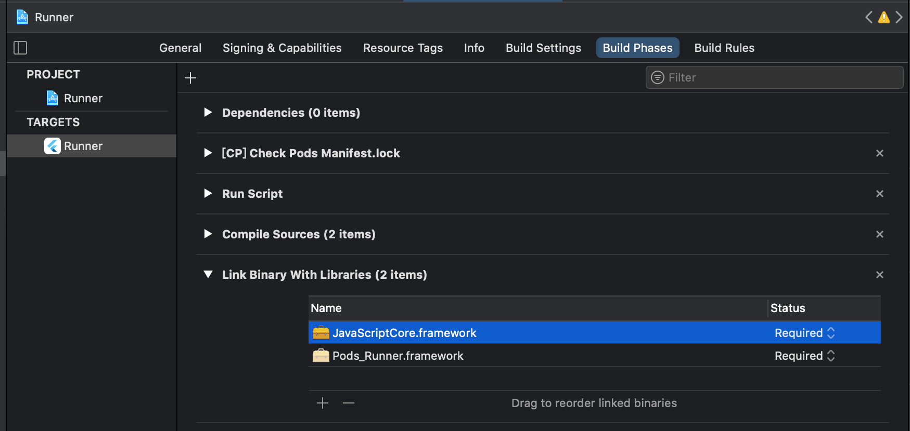

# Dart wrapper of `JavaScriptCore` and `QuickJS`

FlutterJS is a <b>Dart</b> wrapper of `JavaScriptCore`(for Mac/iOS) and `QuickJS`(for Android/Windows/Linux).

## Features

### Builtin

- setTimeout

- console.log

- NodeJS-like `require`

- [HTTP request ability](../modules/fjs_module_http)(expose HTTP api of *dart:io* to JS)

### Data types support and codecs

This plugin uses `ffi` to receive data from JavaScript and vice versa.

The following table shows how they are converted:

| Dart                              | JavaScript    | JavaScript    | Dart                 |
| --------------------------------- | ------------- | ------------- | -------------------- |
| null                              | null          | null          | null                 |
| null                              | undefined     | undefined     | null<sup>1</sup>     |
| bool                              | boolean       | boolean       | bool                 |
| int                               | Number        | Number(int)   | int                  |
| double                            | Number        | Number(float) | double<sup>2</sup>   |
| DateTime                          | Number        | Date          | DateTime<sup>3</sup> |
| String                            | String        | String        | String               |
| TypedData&`List<int>`<sup>4</sup> | ArrayBuffer   | ArrayBuffer   | Uint8List            |
| List                              | Array         | Array         | List                 |
| Map                               | Object        | Object        | `Map<String, dynamic>` |
| Function<sup>4</sup>              | Function      | Function      | Function             |
| Future                            | Promise       | Promise       | Future               |
| Exception                         | Error         | Error         | JSError              |
| Error                             | Error         |               |                      |

**Note:**

1. Set `Vm.reserveUndefined=true` to convert JS `undefined` to `DART_UNDEFINED`(a const Symbol).

2. JS `Number` values without fractional part are stored as `int` in QuickJS, and thus converted to type `int` in Dart.

3. A Dart `DateTime` is constructed for JS `Date` value if `Vm.constructDate=true`.

4. If a `List<int>` is also a TypedData, it will be converted to JS `ArrayBuffer`, otherwise a normal `Array`.

5. Dart functions must have the same signature with `JSToDartFunction` to be able to be converted to JS `function` or an `JSError` will be thrown. Meanwhile, a Dart function received from JS has the same signature with `JSToDartFunction`.

## Installation

Add `fjs` to your `pubspec.yaml` 

```yaml
dependencies:
# until it is published to pub.dev.
#  fjs: 0.1.0
```

Or use the github url

```yaml
dependencies:
  fjs:
    git: https://github.com/dolphinxx/fjs
```

### Android


### iOS


## Usage

## Evaluate JavaScript source code

```dart
vm.evalCode('console.log("Hello World!")');
```

## Call a JavaScript function

```dart
vm.callFunction(function, thisObj, args);
```

## Add a dart function to JavaScript

```dart
vm.newFunction('plus', (List<JSValuePointer> args, {JSValuePointer thisObj}) {
  return vm.dartToJS(args[0] + args[1]);
});
```

```javascript
const result = plus(1, 2);
console.log(result);
// output: 3
```

**Tip:** You can return a Future from the callback of `newFunction`, and convert it to JS `Promise` through `vm.dartToJS`.

## Run Tests

### Prerequisite

#### QuickJS

##### Windows

Go to *native/windows* and run *build.bat*, it will generate *libquickjs.dll* under *native/windows/build*, create an environment variable `QUICKJS_TEST_PATH` and set its value to the absolute path of *libquickjs.dll*.

There is a prebuilt [libquckjs.dll](../fjs_windows/windows/shared/libquckjs.dll), you can set it as the value of `QUICKJS_TEST_PATH` environment variable.

#### JavaScriptCore

##### Mac

As mentioned [here](https://flutter.dev/docs/development/platform-integration/c-interop#platform-library),
you need to add `JavaScriptCore` library in Xcode.



##### Windows

In order to run `JavaScriptCore` on Windows, you need to setup a runnable `JavaScriptCore` in your `PATH`.

[jsvu](https://github.com/GoogleChromeLabs/jsvu) provides an easy way for this.

  Install `jsvu` and then run `jsvu` command to install `JavaScriptCore`, add the absolute path of `.jsvu\engines\javascriptcore` to your `PATH`

  Download [WebKitRequirements](https://github.com/WebKitForWindows/WebKitRequirements/releases) and add the absolute path of `WebKitRequirementsWin64\bin64` to your `PATH`.

### Unit test

**Run all unit tests under *test* folder**


```bash
flutter test ./test
```

### Integration test

**Run integration tests with flutter_driver**

Go to [example](./example) and run:

```bash
flutter drive --target=test_driver/app.dart --driver=test_driver/dart_to_js_test.dart
flutter drive --target=test_driver/app.dart --driver=test_driver/js_to_dart_test.dart
```

**note:** you need an emulator or a real device for integration tests.

You can add `--device-id` to specify the device to run tests. eg: `--device-id=windows` to run tests on windows.

